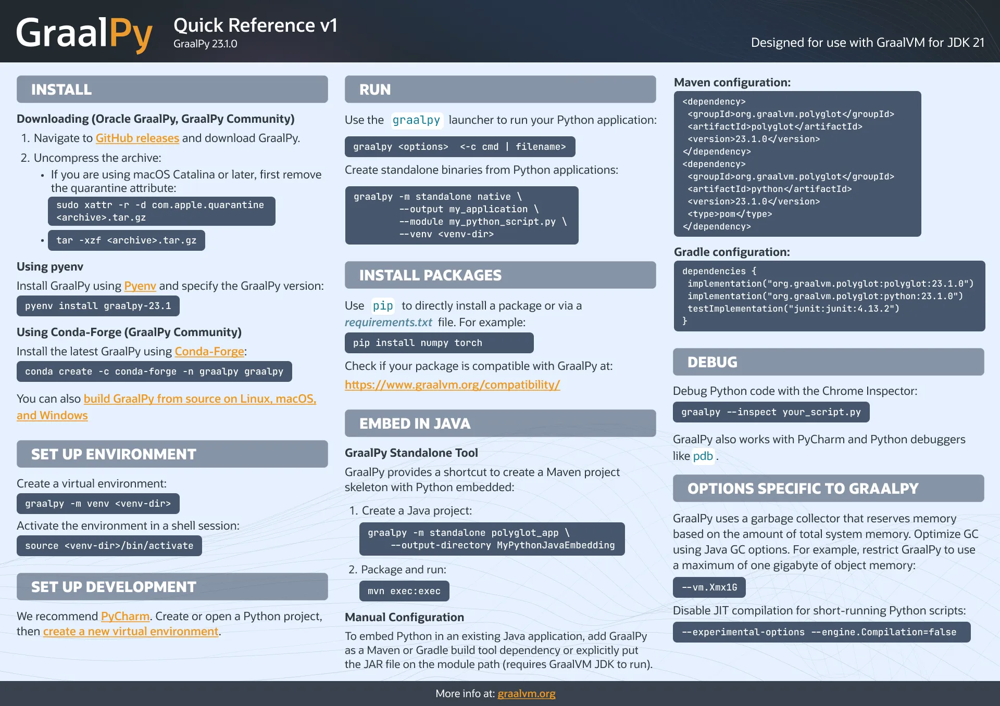

# GraalPy, the GraalVM Implementation of Python

GraalPy is a high-performance implementation of the [Python](https://www.python.org/) language for the JVM built on [GraalVM](https://www.graalvm.org/) technology.
GraalPy has first-class support for embedding in Java and can turn Python applications into fast, standalone binaries.

<sup>
[Java embedding](https://github.com/timfel/graalpy-jbang) using [JBang](https://www.jbang.dev/) — [Standalone binary](https://github.com/timfel/racing-all-afternoon) of Python a game by [Joey Navarro](https://github.com/josephnavarro/racing-all-afternoon) with all dependencies included.
</sup>

## Why GraalPy?

**Low-overhead integration with Java and other languages.**

* [Interoperate](docs/user/Interoperability.md) with Java, JavaScript, Ruby, and other languages on GraalVM JDK, Oracle JDK, or OpenJDK
* Easy to use with [Maven build tools](docs/user/PythonStandaloneBinaries.md#embedding-graalpy-in-a-java-application)
* Monitor Python execution with JVM tools such as [VisualVM](http://visualvm.org/) or JFR
* GraalVM Native Image [compilation is well supported](docs/user/PythonNativeimages.md)
* Manage Python libraries' system access thanks to GraalPy's [Java-based emulation of Python OS APIs](docs/user/OsInterface.md#java-backend)

**Compatible with the Python ecosystem**

* Use almost any standard Python feature, the CPython tests run on every commit and pass ~85%
* Access many [PyPI packages](https://pypi.org/) including *NumPy*, *PyTorch*, *Tensorflow*, and *SciPy*
* Run models such as Stable Diffusion or GPT from [Hugging Face](https://huggingface.co/)
* See if the packages you need work with our [Python Compatibility Checker](https://www.graalvm.org/python/compatibility/)
<sup>
We run the tests of the [top PyPI packages](https://hugovk.github.io/top-pypi-packages/) on GraalPy every day.
For more than 96% of the top PyPI packages, there is at least one recent version that installs successfully and we are currently passing over 50% of all tests those top packages.
</sup>

**Runs Python code faster**

* Pure Python code is often faster than on CPython thanks to JIT compilation
* C extensions performance is close to CPython but varies depending on the specific interactions of native and Python code
* Geomean speedup of ~4 on the [Python Performance Benchmark Suite](https://pyperformance.readthedocs.io/) over CPython
<sup>
Benchmarks run via `pip install pyperformance && pyperformance run` on each of CPython, Jython, and GraalPy.
Installation of each done via <tt>[pyenv](https://github.com/pyenv/pyenv)</tt>.
Geomean speedup was calculated pair-wise against CPython on the intersection of benchmarks that run on both interpreters.
</sup>

## Getting Started

<details>
<summary><strong>Embedding GraalPy in Java</strong></summary>

GraalPy is [available on Maven Central](https://central.sonatype.com/artifact/org.graalvm.polyglot/python) for inclusion in Java projects.
Refer to our [embedding documentation](https://www.graalvm.org/latest/reference-manual/embed-languages/) for more details.

* Maven
  ```xml
  <dependency>
      <groupId>org.graalvm.polyglot</groupId>
      <artifactId>polyglot</artifactId>
      <version>23.1.2</version>
  </dependency>
  <dependency>
      <groupId>org.graalvm.polyglot</groupId>
      <artifactId>python</artifactId>
      <version>23.1.2</version>
      <type>pom</type>
  </dependency>
  ```

* Gradle
  ```kotlin
  implementation("org.graalvm.polyglot:polyglot:23.1.2")
  implementation("org.graalvm.polyglot:python:23.1.2")
  ```

</details>

<details>
<summary><strong>Replacing CPython with GraalPy</strong></summary>

GraalPy should in many cases work as a drop-in replacement for CPython.
You can use `pip` to install packages as usual.
Packages with C code usually do not provide binaries for GraalPy, so they will be automatically compiled during installation.
This means that build tools have to be available and installation will take longer.
We provide [Github actions](scripts/wheelbuilder) to help you build binary packages with the correct dependencies.
Thanks to our integration with GraalVM Native Image, we can deploy Python applications as [standalone binary](docs/user/PythonStandaloneBinaries.md), all dependencies included.

* Linux

  The easiest way to install GraalPy on Linux is to use [Pyenv](https://github.com/pyenv/pyenv) (the Python version manager).
  To install version 23.1.1 using Pyenv, run the following commands:
  ```bash
  pyenv install graalpy-23.1.1
  ```
  ```bash
  pyenv shell graalpy-23.1.1
  ```
  
  Alternatively, you can download a compressed GraalPy installation file from [GitHub releases](https://github.com/oracle/graalpython/releases).
  
  1. Find the download that matches the pattern _graalpy-XX.Y.Z-linux-amd64.tar.gz_ or _graalpy-XX.Y.Z-linux-aarch64.tar.gz_ (depending on your platform) and download.
  2. Uncompress the file and update your `PATH` environment variable to include the _graalpy-XX.Y.Z-linux-amd64/bin_ (or _graalpy-XX.Y.Z-linux-aarch64/bin_) directory.

* macOS

  The easiest way to install GraalPy on macOS is to use [Pyenv](https://github.com/pyenv/pyenv) (the Python version manager).
  To install version 23.1.1 using Pyenv, run the following commands:
  ```bash
  pyenv install graalpy-23.1.1
  ```
  ```bash
  pyenv shell graalpy-23.1.1
  ```
  Alternatively, you can download a compressed GraalPy installation file from [GitHub releases](https://github.com/oracle/graalpython/releases).
  
  1. Find the download that matches the pattern _graalpy-XX.Y.Z-macos-amd64.tar.gz_ or _graalpy-XX.Y.Z-macos-aarch64.tar.gz_ (depending on your platform) and download. 
  2. Remove the quarantine attribute.
      ```bash
      sudo xattr -r -d com.apple.quarantine /path/to/graalpy
      ```
      For example:
      ```bash
      sudo xattr -r -d com.apple.quarantine ~/.pyenv/versions/graalpy-23.1.1
      ```
  3. Uncompress the file and update your `PATH` environment variable to include to the _graalpy-XX.Y.Z-macos-amd64/bin_ (or _graalpy-XX.Y.Z-macos-aarch64/bin_) directory.

* Windows

  The Windows support of GraalPy is still experimental, so not all features and packages may be available.
  
  1. Find and download a compressed GraalPy installation file from [GitHub releases](https://github.com/oracle/graalpython/releases) that matches the pattern _graalpy-XX.Y.Z-windows-amd64.tar.gz_.
  2. Uncompress the file and update your `PATH` variable to include to the _graalpy-XX.Y.Z-windows-amd64/bin_ directory.
  
</details>
<details>
<summary><strong>Using GraalPy in Github Actions</strong></summary>

The _setup-python_ action supports GraalPy:

```
    - name: Setup GraalPy
      uses: actions/setup-python@main
      with:
        python-version: graalpy # or graalpy23.1 to pin a version
```

</details>
<details>
<summary><strong>Migrating Jython Scripts to GraalPy</strong></summary>

Most existing Jython code that uses Java integration will be based on a stable Jython release&mdash;however, these are only available in Python 2.x versions.
To migrate your code from Python 2 to Python 3, follow [the official guide from the Python community](https://docs.python.org/3/howto/pyporting.html).
GraalPy also provides a [special mode](docs/user/Jython.md) to facilitate migration.
To run Jython scripts, you need to use a GraalPy distribution running on the JVM so you can access Java classes from Python scripts.

* Linux
  
  1. Find and download a compressed GraalPy installation file from [GitHub releases](https://github.com/oracle/graalpython/releases) that matches the pattern _graalpy-jvm-XX.Y.Z-linux-amd64.tar.gz_ or _graalpy-jvm-XX.Y.Z-linux-aarch64.tar.gz_ (depending on your platform) and download.
  2. Uncompress the file and update your `PATH` environment variable to include the _graalpy-jvm-XX.Y.Z-linux-amd64/bin_ (or _graalpy-jvm-XX.Y.Z-linux-aarch64/bin_) directory.
  3. Run your scripts with `graalpy --python.EmulateJython`.

* macOS

  1. Find and download a compressed GraalPy installation file from [GitHub releases](https://github.com/oracle/graalpython/releases) that matches the pattern  _graalpy-jvm-XX.Y.Z-macos-amd64.tar.gz_ or _graalpy-jvm-XX.Y.Z-macos-aarch64.tar.gz_ (depending on your platform) and download.
  2. Remove the quarantine attribute.
      ```bash
      sudo xattr -r -d com.apple.quarantine /path/to/graalpy
      ```
      For example:
      ```bash
      sudo xattr -r -d com.apple.quarantine ~/.pyenv/versions/graalpy-23.1.1
      ```
  3. Uncompress the file and update your `PATH` environment variable to include to the _graalpy-jvm-XX.Y.Z-macos-amd64/bin_ (or _graalpy-jvm-XX.Y.Z-macos-aarch64/bin_) directory.
  4. Run your scripts with `graalpy --python.EmulateJython`.

* Windows

  1. Find and download a compressed GraalPy installation file from [GitHub releases](https://github.com/oracle/graalpython/releases) that matches the pattern _graalpy-jvm-XX.Y.Z-windows-amd64.tar.gz_.
  2. Uncompress the file and update your `PATH` variable to include to the _graalpy-jvm-XX.Y.Z-windows-amd64/bin_ directory.
  3. Run your scripts with `graalpy --python.EmulateJython`.

</details>

## Documentation



We have [Quick Reference Sheet](https://www.graalvm.org/uploads/quick-references/GraalPy_v1/quick-reference-graalpy-v1(eu_a4).pdf) to help you get started quickly.
More user documentation is available in [docs/user](docs/user).

## Contact

The best way to get in touch with us is to join the `#graalpy` channel on [GraalVM Slack](https://www.graalvm.org/slack-invitation/).

## Contributing

If you're thinking about contributing something to this repository, you will need to sign the [Oracle Contributor Agreement](http://www.graalvm.org/community/contributors/) for us to able to merge your work.
Please also take note of our [code of conduct](http://www.graalvm.org/community/conduct/) for contributors.

This project welcomes contributions from the community. Before submitting a pull request, please [review our contribution guide](./CONTRIBUTING.md).

## Security

Please consult the [security guide](./SECURITY.md) for our responsible security vulnerability disclosure process.

## License

This GraalVM implementation of Python is Copyright (c) 2017, 2024 Oracle and/or its affiliates and is made available to you under the terms the Universal Permissive License v 1.0 as shown at [https://oss.oracle.com/licenses/upl/](https://oss.oracle.com/licenses/upl/).
This implementation is in part derived from and contains additional code from 3rd parties, the copyrights and licensing of which is detailed in the [LICENSE](./LICENSE.txt) and [THIRD_PARTY_LICENSE](THIRD_PARTY_LICENSE.txt) files.
