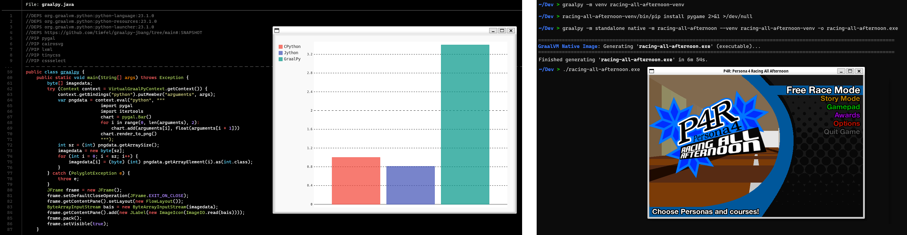

# GraalPy, the GraalVM Implementation of Python

[](https://central.sonatype.com/artifact/org.graalvm.polyglot/python)
[](#start-replacing-cpython-with-graalpy)
</a> [![Join Slack][badge-slack]][slack] [![GraalVM on Twitter][badge-twitter]][twitter] [](#license)

[](https://codespaces.new/oracle/graalpython)

GraalPy is a high-performance implementation of the Python language for the JVM built on [GraalVM](https://www.graalvm.org/python).
GraalPy is a Python 3.12 compliant runtime.
It has first-class support for embedding in Java and can turn Python applications into fast, standalone binaries.
GraalPy is ready for production running pure Python code and has experimental support for many popular native extension modules.

## Why GraalPy?

**Low-overhead integration with Java and other languages**

* Use [Python in Java](docs/user/Interoperability.md) applications on GraalVM JDK, Oracle JDK, or OpenJDK
* Use JVM tools like [Maven](docs/user/Embedding-Build-Tools.md), JFR, or [GraalVM Native Image](docs/user/Native-Images-with-Python.md)
* Manage Python libraries' system access thanks to GraalPy's [Java-based emulation of Python OS APIs](docs/user/Embedding-Permissions.md)

**Compatible with the Python ecosystem**

* Use almost any standard Python feature, the CPython tests run on every commit and pass ~85%
* See if the packages you need work according to our [Python Compatibility Checker](https://www.graalvm.org/python/compatibility/)
* Support for native extension modules is considered experimental, but you can already install [packages](docs/user/Python-Runtime.md#installing-packages) like *NumPy*, *PyTorch*, or *Tensorflow*; run [Hugging Face](https://huggingface.co/) models like *Stable Diffusion* or *GPT*
<sup>
We run the tests of the [most depended on PyPI packages](https://libraries.io/pypi) every day.
For 97% of those packages a recent version can be installed on GraalPy and GraalPy passes over 60% of all tests of all packages combined.
We assume that CPython not passing 100% of all tests is due to problems in our infrastructure that may also affect GraalPy.
Packages where CPython fails all tests are marked as "not tested" for both CPython and GraalPy.
</sup>

**Runs Python code faster**

* Pure Python code is often faster than on CPython after JIT compilation
* C extension performance is near CPython, but varies depending on the specific interactions of native and Python code
* GraalPy is ~4x faster than CPython on the official [Python Performance Benchmark Suite](https://pyperformance.readthedocs.io/)
<sup>
Benchmarks run via `pip install pyperformance && pyperformance run` on each of CPython and GraalPy.
Harness and benchmarks were adapted by hand for Jython due to missing Python 3 support.
Each interpreter was installed via <tt>[pyenv](https://github.com/pyenv/pyenv)</tt>.
Geomean speedup was calculated against CPython on the intersection of benchmarks that run on all interpreters.
</sup>

## Getting Started

<details>
<summary><strong><a name="start-embedding-graalpy-in-java"></a>Embedding GraalPy in Java</strong></summary>

GraalPy is [available on Maven Central](https://central.sonatype.com/artifact/org.graalvm.polyglot/python) for inclusion in Java projects.
Refer to our [embedding documentation](https://www.graalvm.org/latest/reference-manual/embed-languages/) for more details.

* Maven
  ```xml
  <dependency>
      <groupId>org.graalvm.polyglot</groupId>
      <artifactId>polyglot</artifactId>
      <version>25.0.2</version>
  </dependency>
  <dependency>
      <groupId>org.graalvm.polyglot</groupId>
      <artifactId>python</artifactId>
      <version>25.0.2</version>
      <type>pom</type>
  </dependency>
  ```

* Gradle
  ```kotlin
  implementation("org.graalvm.polyglot:polyglot:25.0.2")
  implementation("org.graalvm.python:python-embedding:25.0.2")
  ```

</details>

<details>
<summary><strong><a name="start-replacing-cpython-with-graalpy"></a>Replacing CPython with GraalPy</strong></summary>

GraalPy should in many cases work as a drop-in replacement for CPython.
You can use `pip` to install packages as usual.
Packages with C code usually do not provide binaries for GraalPy, so they will be automatically compiled during installation.
This means that build tools have to be available and installation will take longer.
We provide [Github actions](scripts/wheelbuilder) to help you build binary packages with the correct dependencies.
Thanks to our integration with GraalVM Native Image, we can deploy Python applications as [standalone binary](docs/user/Python-Standalone-Applications.md), all dependencies included.

**Quick Installation:**

- **Linux/macOS**: `pyenv install graalpy-25.0.2 && pyenv shell graalpy-25.0.2`
- **Windows**: `pyenv install graalpy-25.0.2-windows-amd64`
- **Manual**: Download from [GitHub releases](https://github.com/oracle/graalpython/releases)

**See the [complete installation guide](docs/user/Standalone-Getting-Started.md) for detailed instructions.**

</details>
<details>
<summary><strong><a name="start-using-graalpy-in-github-actions"></a>Using GraalPy in Github Actions</strong></summary>

The _setup-python_ action supports GraalPy:

```yaml
    - name: Setup GraalPy
      uses: actions/setup-python@v5
      with:
        python-version: graalpy # or graalpy24.2 to pin a version
```

</details>
<details>
<summary><strong><a name="start-migrating-jython-scripts-to-graalpy"></a>Migrating Jython Scripts to GraalPy</strong></summary>

Most existing Jython code that uses Java integration will be based on a stable Jython release—however, these are only available in Python 2.x versions.
To migrate your code from Python 2 to Python 3, follow [the official guide from the Python community](https://docs.python.org/3/howto/pyporting.html).
GraalPy provides a [special mode](docs/user/Python-on-JVM.md) to facilitate migration.

**Quick Setup:**

1. Download a GraalPy JVM distribution: `graalpy-jvm-XX.Y.Z-<platform>.tar.gz`
2. Extract and add to PATH
3. Run with: `graalpy --python.EmulateJython`

**See the [complete migration guide](docs/user/Python-on-JVM.md) for detailed instructions.**

</details>

### Examples
<sup>
[Java AWT app with Python graph library](https://github.com/timfel/graalpy-jbang) using [JBang](https://www.jbang.dev/)  |  [Standalone binary](https://github.com/timfel/racing-all-afternoon) of a Python game by [Joey Navarro](https://github.com/josephnavarro/racing-all-afternoon) with all dependencies included.
</sup>

## Documentation

[GraalPy Quick Reference Sheet](https://www.graalvm.org/uploads/quick-references/GraalPy_v1/quick-reference-graalpy-v1(eu_a4).pdf) should help you get started.
More GraalPy-specific user documentation is available in [docs/user](docs/user).
General documentation about [polyglot programming](https://www.graalvm.org/latest/reference-manual/polyglot-programming/) and [language embedding](https://www.graalvm.org/latest/reference-manual/embed-languages/) is available on the GraalVM website.

## Community

The best way to get in touch with us is to join the `#graalpy` channel on [GraalVM Slack][slack] or [tweet us][twitter].

## Contributing

This project welcomes contributions from the community. Before submitting a pull request, please [review our contribution guide](./CONTRIBUTING.md).

If you're thinking about contributing something to this repository, you will need to sign the [Oracle Contributor Agreement](https://www.graalvm.org/community/contributors/) for us to able to merge your work.
Also take a look at the [code of conduct](https://www.graalvm.org/community/conduct/) for contributors.

## Security

Consult the [security guide](./SECURITY.md) for our responsible security vulnerability disclosure process.

## License

This GraalVM implementation of Python is Copyright (c) 2017, 2026 Oracle and/or its affiliates and is made available to you under the terms the Universal Permissive License v 1.0 as shown at [https://oss.oracle.com/licenses/upl/](https://oss.oracle.com/licenses/upl/).
This implementation is in part derived from and contains additional code from 3rd parties, the copyrights and licensing of which is detailed in the [LICENSE](./LICENSE.txt) and [THIRD_PARTY_LICENSE](THIRD_PARTY_LICENSE.txt) files.

[badge-slack]: https://img.shields.io/badge/Slack-join-active?logo=slack
[badge-twitter]: https://img.shields.io/badge/Twitter-@graalvm-active?logo=twitter
[slack]: https://www.graalvm.org/slack-invitation/
[twitter]: https://twitter.com/graalvm
