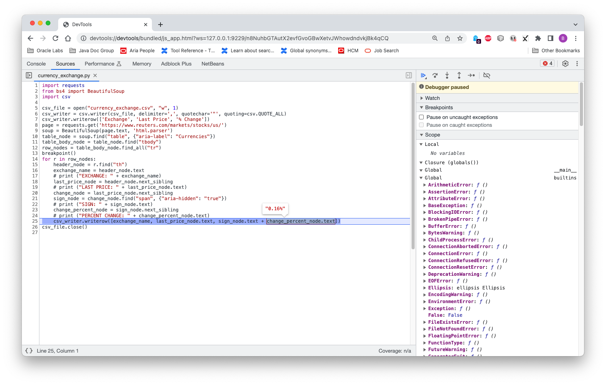

# Tooling Support for Python

## Debugging

GraalPy provides the standard Python debugger `pdb`.
Refer to the official [PDB documentation](https://docs.python.org/3/library/pdb.html) for usage.
The built-in `breakpoint()` function uses `pdb` by default.

GraalPy also comes with built-in support for graphical debugging through Chrome's developer tools.
To enable the debugger, pass the `--inspect` command-line option.
You can inspect variables, set watch expressions, interactively evaluate code snippets, and so on.

1. Run a Python script using the command-line option `--inspect`:
    ```bash
    graalpy --inspect my_script.py
    ``` 

2. You should see output similar to:
    ```bash
    Debugger listening on ws://127.0.0.1:9229/VrhCaY7wR5tIqy2zLsdFr3f7ixY3QB6kVQ0S54_SOMo
    For help, see: https://www.graalvm.org/tools/chrome-debugger
    E.g. in Chrome open: devtools://devtools/bundled/js_app.html?ws=127.0.0.1:9229/VrhCaY7wR5tIqy2zLsdFr3f7ixY3QB6kVQ0S54_SOMo
    ```

3. Open your Chrome browser and enter the URL provided. 
Now you can inspect the stack, variables, evaluate variables, and selected expressions in a tooltip, and so on. For example: 

   

## Profiling

GraalPy provides three main profiling capabilities: a CPU sampler, a CPU tracer, and a memory tracer.
These are described below. (For details, use the `graalpy --help:tools` command.)

## CPU Sampler

Use the `--cpusampler` command-line option to take a CPU sample. For example:
```bash
graalpy --cpusampler my_script.py
```

You should see output similar to:

{::options parse_block_html="true" /}
<details><summary markdown="span">CPU Sampler Output (Click to expand)</summary>
```
--------------------------------------------------------------------------------------------------------------------------------------------------------------
Sampling Histogram. Recorded 564 samples with period 10ms. Missed 235 samples.
  Self Time: Time spent on the top of the stack.
  Total Time: Time spent somewhere on the stack.
--------------------------------------------------------------------------------------------------------------------------------------------------------------
Thread[main,5,main]
 Name                                                                       ||             Total Time    ||              Self Time    || Location            
--------------------------------------------------------------------------------------------------------------------------------------------------------------
 parse_starttag                                                             ||             1090ms  19.3% ||              570ms  10.1% || <install-dir>/lib/python3.10/html/parser.py~300-347:11658-13539
 match                                                                      ||              190ms   3.4% ||              190ms   3.4% || <venv-dir>/lib/python3.10/site-packages/soupsieve/css_parser.py~320-323:9862-10026
 _replace_cdata_list_attribute_values                                       ||              190ms   3.4% ||              190ms   3.4% || <venv-dir>/lib/python3.10/site-packages/bs4/builder/__init__.py~295-331:11245-13031
 goahead                                                                    ||             1430ms  25.4% ||              150ms   2.7% || <install-dir>/lib/python3.10/html/parser.py~133-250:4711-9678
 check_for_whole_start_tag                                                  ||              130ms   2.3% ||              130ms   2.3% || <install-dir>/lib/python3.10/html/parser.py~351-382:13647-14758
 <module>                                                                   ||              800ms  14.2% ||              130ms   2.3% || <venv-dir>/lib/python3.10/site-packages/soupsieve/css_parser.py~1-1296:0-47061
 ...
--------------------------------------------------------------------------------------------------------------------------------------------------------------
```
</details>
{::options parse_block_html="false" /}

## CPU Tracer

Use the `--cputracer --cputracer.TraceStatements` command-line options to trace CPU usage. For example:
```bash
graalpy --cputracer --cputracer.TraceStatements my_script.py
```

You should see output similar to:

{::options parse_block_html="true" /}
<details><summary markdown="span">CPU Tracer Output (Click to Expand)</summary>
```
--------------------------------------------------------------------------------------------------------------------
Tracing Histogram. Counted a total of 1135 element executions.
  Total Count: Number of times the element was executed and percentage of total executions.
  Interpreted Count: Number of times the element was interpreted and percentage of total executions of this element.
  Compiled Count: Number of times the compiled element was executed and percentage of total executions of this element.
--------------------------------------------------------------------------------------------------------------------
 Name                                |          Total Count |    Interpreted Count |       Compiled Count | Location
--------------------------------------------------------------------------------------------------------------------
 get_newfunc_typeid                  |           110   9.7% |           110 100.0% |             0   0.0% | capi.c~596:0
 PyTruffle_PopulateType              |           110   9.7% |           110 100.0% |             0   0.0% | capi.c~721:0
 PyTruffle_AllocMemory               |            86   7.6% |            86 100.0% |             0   0.0% | obmalloc.c~77:0
 PyTruffle_AllocateType              |            66   5.8% |            66 100.0% |             0   0.0% | capi.c~874:0
 PyMem_RawMalloc                     |            66   5.8% |            66 100.0% |             0   0.0% | obmalloc.c~170:0
 initialize_type_structure           |            50   4.4% |            50 100.0% |             0   0.0% | capi.c~181:0
 _Py_TYPE                            |            45   4.0% |            45 100.0% |             0   0.0% | object_shared.c~55:0
 PyType_GetFlags                     |            41   3.6% |            41 100.0% |             0   0.0% | typeobject_shared.c~44:0
 get_tp_name                         |            37   3.3% |            37 100.0% |             0   0.0% | capi.c~507:0
 ...    
--------------------------------------------------------------------------------------------------------------------
```
</details>
{::options parse_block_html="false" /}

#### Memory Tracer

Use the `--memtracer --memtracer.TraceStatements` command-line options to trace memory usage. For example:
```bash
graalpy --experimental-options --memtracer --memtracer.TraceStatements my_script.py
```

You should see output similar to:

{::options parse_block_html="true" /}

<details><summary markdown="span">Memory Tracer Output (Click to Expand)</summary>
```
----------------------------------------------------------------------------
 Location Histogram with Allocation Counts. Recorded a total of 565 allocations.
   Total Count: Number of allocations during the execution of this element.
   Self Count: Number of allocations in this element alone (excluding sub calls).
----------------------------------------------------------------------------
 Name                         |      Self Count |     Total Count | Location
----------------------------------------------------------------------------
 PyTruffle_PopulateType       |      440  77.9% |      440  77.9% | capi.c~721:0
 PyType_Ready                 |       61  10.8% |       68  12.0% | typeobject.c~463:0
 _PyObject_MakeTpCall         |       20   3.5% |       24   4.2% | object.c~155:0
 PyUnicode_FromString         |       11   1.9% |       11   1.9% | capi.c~2161:0
 PyErr_NewException           |       11   1.9% |       11   1.9% | capi.c~1537:0
 _PyUnicode_AsASCIIString     |        6   1.1% |        6   1.1% | capi.c~2281:0
 PyDict_New                   |        4   0.7% |        4   0.7% | capi.c~1505:0
 PyTuple_New                  |        4   0.7% |        4   0.7% | capi.c~2097:0
 PyUnicode_FromStringAndSize  |        3   0.5% |        3   0.5% | unicodeobject.c~171:0
 ...
----------------------------------------------------------------------------
```
</details>
{::options parse_block_html="false" /}

## Coverage

GraalPy provides its own implementation of the [Coverage.py tool](https://pypi.org/project/coverage/) to measure code coverage of Python programs.
Enable it using the `--coverage` command-line option, as shown below.
(For details, use the `graalpy --help:tools` command.)

```bash
graalpy --coverage my_script.py
```
You should see output similar to:

{::options parse_block_html="true" /}
<details><summary markdown="span">CPU Sampler Output (Click to expand)</summary>
```
------------------------------------------------------------------------------------------------------------------------------------------------
Code coverage histogram.
  Shows what percent of each element was covered during execution
------------------------------------------------------------------------------------------------------------------------------------------------
 Path                                                                          |  Statements |    Lines |    Roots
------------------------------------------------------------------------------------------------------------------------------------------------
 <venv-dir>/lib/python3.10/site-packages/_distutils_hack/__init__.py           |       0.00% |    0.00% |    0.00%
 <venv-dir>/lib/python3.10/site-packages/bs4/__init__.py                       |      56.10% |   56.14% |   55.26%
 <venv-dir>/lib/python3.10/site-packages/bs4/builder/__init__.py               |      79.12% |   78.84% |   50.00%
 <venv-dir>/lib/python3.10/site-packages/bs4/builder/_html5lib.py              |       2.41% |    2.46% |    2.38%
 <venv-dir>/lib/python3.10/site-packages/bs4/builder/_htmlparser.py            |      69.08% |   68.67% |   83.33%
 <venv-dir>/lib/python3.10/site-packages/bs4/builder/_lxml.py                  |       3.72% |    3.78% |    4.00%
 <venv-dir>/lib/python3.10/site-packages/bs4/css.py                            |      32.73% |   31.48% |   15.38%
 <venv-dir>/lib/python3.10/site-packages/bs4/dammit.py                         |      65.46% |   65.29% |   24.14%
 <venv-dir>/lib/python3.10/site-packages/bs4/element.py                        |      44.15% |   43.13% |   31.08%
 <venv-dir>/lib/python3.10/site-packages/bs4/formatter.py                      |      73.49% |   74.36% |   66.67%
 <venv-dir>/lib/python3.10/site-packages/certifi/__init__.py                   |     100.00% |  100.00% |  100.00%
 <venv-dir>/lib/python3.10/site-packages/certifi/core.py                       |      33.33% |   33.33% |   25.00%
 <venv-dir>/lib/python3.10/site-packages/charset_normalizer/__init__.py        |     100.00% |  100.00% |  100.00%
 <venv-dir>/lib/python3.10/site-packages/charset_normalizer/api.py             |      11.87% |   11.94% |   16.67%
 <venv-dir>/lib/python3.10/site-packages/charset_normalizer/assets/__init__.py |     100.00% |  100.00% |  100.00%
 <venv-dir>/lib/python3.10/site-packages/charset_normalizer/cd.py              |      12.81% |   13.54% |    4.35%
 <venv-dir>/lib/python3.10/site-packages/charset_normalizer/constant.py        |     100.00% |  100.00% |  100.00%
 <venv-dir>/lib/python3.10/site-packages/charset_normalizer/legacy.py          |      25.00% |   25.00% |   50.00%
 <venv-dir>/lib/python3.10/site-packages/charset_normalizer/md.py              |      22.05% |   20.37% |   17.24%
 <venv-dir>/lib/python3.10/site-packages/charset_normalizer/models.py          |      38.46% |   38.50% |    9.30%
 <venv-dir>/lib/python3.10/site-packages/charset_normalizer/utils.py           |      26.79% |   26.89% |    3.33%
 <venv-dir>/lib/python3.10/site-packages/charset_normalizer/version.py         |     100.00% |  100.00% |  100.00%
 <venv-dir>/lib/python3.10/site-packages/idna/__init__.py                      |     100.00% |  100.00% |  100.00%
 <install-dir>/lib/python3.10/collections/abc.py                               |     100.00% |  100.00% |  100.00%
 <install-dir>/lib/python3.10/contextlib.py                                    |      40.80% |   37.99% |   31.71%
 <install-dir>/lib/python3.10/copy.py                                          |      36.36% |   36.41% |   21.43%
 <install-dir>/lib/python3.10/copyreg.py                                       |       3.20% |    3.20% |    7.69%
 <install-dir>/lib/python3.10/csv.py                                           |      25.17% |   23.91% |   25.00%
 <install-dir>/lib/python3.10/datetime.py                                      |      30.32% |   30.01% |   14.74%
 <install-dir>/lib/python3.10/email/__init__.py                                |      42.86% |   42.86% |   20.00%
 <install-dir>/lib/python3.10/email/_encoded_words.py                          |      35.11% |   34.44% |   14.29%
 <install-dir>/lib/python3.10/email/_parseaddr.py                              |      12.64% |   12.15% |   10.71%
 <install-dir>/lib/python3.10/email/_policybase.py                             |      55.22% |   54.69% |   39.29%
 <install-dir>/lib/python3.10/email/base64mime.py                              |      35.00% |   35.00% |   20.00%
 <install-dir>/lib/python3.10/typing.py                                        |      49.86% |   48.93% |   34.60%
 <install-dir>/lib/python3.10/urllib/__init__.py                               |     100.00% |  100.00% |  100.00%
 <install-dir>/lib/python3.10/warnings.py                                      |      21.29% |   20.77% |   25.00%
 <install-dir>/lib/python3.10/weakref.py                                       |      37.93% |   36.78% |   23.68%
 <install-dir>/lib/python3.10/zipfile.py                                       |      17.86% |   17.23% |   11.03%
 <src-dir>/my_script.py                                                        |     100.00% |  100.00% |  100.00%
------------------------------------------------------------------------------------------------------------------------------------------------
```
</details>
{::options parse_block_html="false" /}

## Trace

The standard Python `trace` module is also provided.
> Note: This works in the same way as CPython.
The programmatic API also works, with some limitations: it does not currently track calls, only line counts and called functions.

For example, the command

```bash
graalpy -m trace -c -s text_styler.py Welcome to GraalPy!
```

Give example output

{::options parse_block_html="true" /}
<details><summary markdown="span">CPU Sampler Output (Click to expand)</summary>
```
_       __     __                             __     
| |     / /__  / /________  ____ ___  ___     / /_____
| | /| / / _ \/ / ___/ __ \/ __ `__ \/ _ \   / __/ __ \
| |/ |/ /  __/ / /__/ /_/ / / / / / /  __/  / /_/ /_/ /
|__/|__/\___/_/\___/\____/_/ /_/ /_/\___/   \__/\____/
                                                        
   ______                 ______        __
  / ____/________ _____ _/ / __ \__  __/ /
 / / __/ ___/ __ `/ __ `/ / /_/ / / / / /
/ /_/ / /  / /_/ / /_/ / / ____/ /_/ /_/ 
\____/_/   \__,_/\__,_/_/_/    \__, (_)  
                              /____/     
 
lines   cov%   module   (path)
    9   100%   __about__   (<venv-dir>/lib/python3.10/site-packages/pkg_resources/_vendor/packaging/__about__.py)
   51   100%   __future__   (<install-dir>/lib/python3.10/__future__.py)
    1   100%   __init__   (<venv-dir>/lib/python3.10/site-packages/pyfiglet/fonts/__init__.py)
   27   100%   _adapters   (<install-dir>/lib/python3.10/importlib/_adapters.py)
   25   100%   _common   (<install-dir>/lib/python3.10/importlib/_common.py)
   44   100%   _manylinux   (<venv-dir>/lib/python3.10/site-packages/pkg_resources/_vendor/packaging/_manylinux.py)
   20   100%   _musllinux   (<venv-dir>/lib/python3.10/site-packages/pkg_resources/_vendor/packaging/_musllinux.py)
   66   100%   _osx_support   (<install-dir>/lib/python3.10/_osx_support.py)
   43   100%   _parseaddr   (<install-dir>/lib/python3.10/email/_parseaddr.py)
   62   100%   _policybase   (<install-dir>/lib/python3.10/email/_policybase.py)
   20   100%   _structures   (<venv-dir>/lib/python3.10/site-packages/pkg_resources/_vendor/packaging/_structures.py)
  105   100%   abc   (<install-dir>/lib/python3.10/importlib/abc.py)
   18   100%   actions   (<venv-dir>/lib/python3.10/site-packages/pkg_resources/_vendor/pyparsing/actions.py)
   41   100%   appdirs   (<venv-dir>/lib/python3.10/site-packages/pkg_resources/_vendor/appdirs.py)
   59   100%   base64   (<install-dir>/lib/python3.10/base64.py)
   14   100%   base64mime   (<install-dir>/lib/python3.10/email/base64mime.py)
   11   100%   bisect   (<install-dir>/lib/python3.10/bisect.py)
  124   100%   calendar   (<install-dir>/lib/python3.10/calendar.py)
   94   100%   charset   (<install-dir>/lib/python3.10/email/charset.py)
  122   100%   common   (<venv-dir>/lib/python3.10/site-packages/pkg_resources/_vendor/pyparsing/common.py)
   40   100%   context   (<venv-dir>/lib/python3.10/site-packages/pkg_resources/_vendor/jaraco/context.py)
    3   100%   contextlib   (<install-dir>/lib/python3.10/contextlib.py)
   91   100%   copy   (<install-dir>/lib/python3.10/copy.py)
 1497   100%   core   (<venv-dir>/lib/python3.10/site-packages/pkg_resources/_vendor/pyparsing/core.py)
  108   100%   dataclasses   (<install-dir>/lib/python3.10/dataclasses.py)
   31   100%   datetime   (<install-dir>/lib/python3.10/datetime.py)
    9   100%   encoders   (<install-dir>/lib/python3.10/email/encoders.py)
 2493   100%   entities   (<install-dir>/lib/python3.10/html/entities.py)
   58   100%   errors   (<install-dir>/lib/python3.10/email/errors.py)
   49   100%   exceptions   (<venv-dir>/lib/python3.10/site-packages/pkg_resources/_vendor/pyparsing/exceptions.py)
    5   100%   expat   (<install-dir>/lib/python3.10/xml/parsers/expat.py)
   41   100%   feedparser   (<install-dir>/lib/python3.10/email/feedparser.py)
   45   100%   functools   (<venv-dir>/lib/python3.10/site-packages/pkg_resources/_vendor/jaraco/functools.py)
   69   100%   gettext   (<install-dir>/lib/python3.10/gettext.py)
   56   100%   header   (<install-dir>/lib/python3.10/email/header.py)
  162   100%   helpers   (<venv-dir>/lib/python3.10/site-packages/pkg_resources/_vendor/pyparsing/helpers.py)
    1   100%   inspect   (<install-dir>/lib/python3.10/inspect.py)
   47   100%   linecache   (<install-dir>/lib/python3.10/linecache.py)
   95   100%   markers   (<venv-dir>/lib/python3.10/site-packages/pkg_resources/_vendor/packaging/markers.py)
  192   100%   more   (<venv-dir>/lib/python3.10/site-packages/pkg_resources/_vendor/more_itertools/more.py)
  204   100%   optparse   (<install-dir>/lib/python3.10/optparse.py)
   14   100%   os   (<install-dir>/lib/python3.10/os.py)
  167   100%   parse   (<install-dir>/lib/python3.10/urllib/parse.py)
   19   100%   parser   (<install-dir>/lib/python3.10/email/parser.py)
  242   100%   pathlib   (<install-dir>/lib/python3.10/pathlib.py)
   66   100%   pkgutil   (<install-dir>/lib/python3.10/pkgutil.py)
  137   100%   platform   (<install-dir>/lib/python3.10/platform.py)
  102   100%   plistlib   (<install-dir>/lib/python3.10/plistlib.py)
   79   100%   pprint   (<install-dir>/lib/python3.10/pprint.py)
   54   100%   queue   (<install-dir>/lib/python3.10/queue.py)
   21   100%   quopri   (<install-dir>/lib/python3.10/quopri.py)
   32   100%   quoprimime   (<install-dir>/lib/python3.10/email/quoprimime.py)
  101   100%   random   (<install-dir>/lib/python3.10/random.py)
   43   100%   recipes   (<venv-dir>/lib/python3.10/site-packages/pkg_resources/_vendor/more_itertools/recipes.py)
   51   100%   requirements   (<venv-dir>/lib/python3.10/site-packages/pkg_resources/_vendor/packaging/requirements.py)
   46   100%   resources   (<install-dir>/lib/python3.10/importlib/resources.py)
  155   100%   results   (<venv-dir>/lib/python3.10/site-packages/pkg_resources/_vendor/pyparsing/results.py)
   79   100%   selectors   (<install-dir>/lib/python3.10/selectors.py)
   30   100%   signal   (<install-dir>/lib/python3.10/signal.py)
   94   100%   socket   (<install-dir>/lib/python3.10/socket.py)
  143   100%   specifiers   (<venv-dir>/lib/python3.10/site-packages/pkg_resources/_vendor/packaging/specifiers.py)
   50   100%   string   (<install-dir>/lib/python3.10/string.py)
  118   100%   subprocess   (<install-dir>/lib/python3.10/subprocess.py)
   96   100%   sysconfig   (<install-dir>/lib/python3.10/sysconfig.py)
   67   100%   tags   (<venv-dir>/lib/python3.10/site-packages/pkg_resources/_vendor/packaging/tags.py)
  119   100%   tempfile   (<install-dir>/lib/python3.10/tempfile.py)
   35   100%   testing   (<venv-dir>/lib/python3.10/site-packages/pkg_resources/_vendor/pyparsing/testing.py)
    7   100%   text_styler   (<src-dir>/text_styler.py)
   51   100%   textwrap   (<install-dir>/lib/python3.10/textwrap.py)
    2   100%   threading   (<install-dir>/lib/python3.10/threading.py)
   32   100%   tokenize   (<install-dir>/lib/python3.10/tokenize.py)
   43   100%   traceback   (<install-dir>/lib/python3.10/traceback.py)
  703   100%   typing   (<install-dir>/lib/python3.10/typing.py)
  238   100%   unicode   (<venv-dir>/lib/python3.10/site-packages/pkg_resources/_vendor/pyparsing/unicode.py)
   76   100%   util   (<venv-dir>/lib/python3.10/site-packages/pkg_resources/_vendor/pyparsing/util.py)
   20   100%   utils   (<venv-dir>/lib/python3.10/site-packages/pkg_resources/_vendor/packaging/utils.py)
    1   100%   version   (<venv-dir>/lib/python3.10/site-packages/pyfiglet/version.py)
   16   100%   warnings   (<install-dir>/lib/python3.10/warnings.py)
  127   100%   weakref   (<install-dir>/lib/python3.10/weakref.py)
  432   100%   zipfile   (<install-dir>/lib/python3.10/zipfile.py)
```
</details>
{::options parse_block_html="false" /}

## Using PyCharm with GraalPy

You can use GraalPy in PyCharm to create a virtual environment, install packages, and develop and run your Python application.

1. Install `graalpy`. (For more information, see [Installing GraalPy](Python-Runtime.md).)

2. Install PyCharm. (For more information, see [Install PyCharm](https://www.jetbrains.com/help/pycharm/installation-guide.html).)

3. Create, or open, a Python project.
(For more information, see [Create a Python project](https://www.jetbrains.com/help/pycharm/creating-empty-project.html), or [Open, reopen, and close projects](https://www.jetbrains.com/help/pycharm/open-projects.html), respectively.)

4. Create a new _venv_ virtual environment for your Python project.
(For more information, see [Create a virtualenv environment](https://www.jetbrains.com/help/pycharm/creating-virtual-environment.html#python_create_virtual_env).)

5. Install packages by following the PyCharm instructions.
(For more information, see [Install, uninstall, and upgrade packages](https://www.jetbrains.com/help/pycharm/installing-uninstalling-and-upgrading-packages.html).)

6. Use the PyCharm menu items to [run your Python application](https://www.jetbrains.com/help/pycharm/running-applications.html). 
Alternatively, use the terminal emulator to run the `graalpy` command.

## Using Visual Studio Code with GraalPy

You can use GraalPy in Visual Studio (VS) Code to create a virtual environment, install packages, and develop and run your Python application.
 
1. Install `graalpy`. (For more information, see [Installing GraalPy](Python-Runtime.md).)

2. Install VS Code and the Python Extension, following the instructions here: [Install Visual Studio Code and the Python Extension](https://code.visualstudio.com/docs/python/python-tutorial#_install-visual-studio-code-and-the-python-extension).

3. Create, or open, a Python file.

4. Create a new _venv_ virtual environment for your Python project.
(For more information, see [Creating environments](https://code.visualstudio.com/docs/python/environments#_creating-environments).)

5. Install packages by following the VS Code instructions.
(For more information, see [Install and use packages](https://code.visualstudio.com/docs/python/python-tutorial#_install-and-use-packages).)

6. Use the VS Code menu items to run your Python application. (For more information, see [Run Hello World](https://code.visualstudio.com/docs/python/python-tutorial#_run-hello-world).)
Alternatively, use a VS Code terminal emulator to run the `graalpy` command.

7. You cannot use VS Code to debug your Python application.
Instead, open a VS Code terminal emulator and follow these instructions: [Debugging a Python Application](#debugging).

