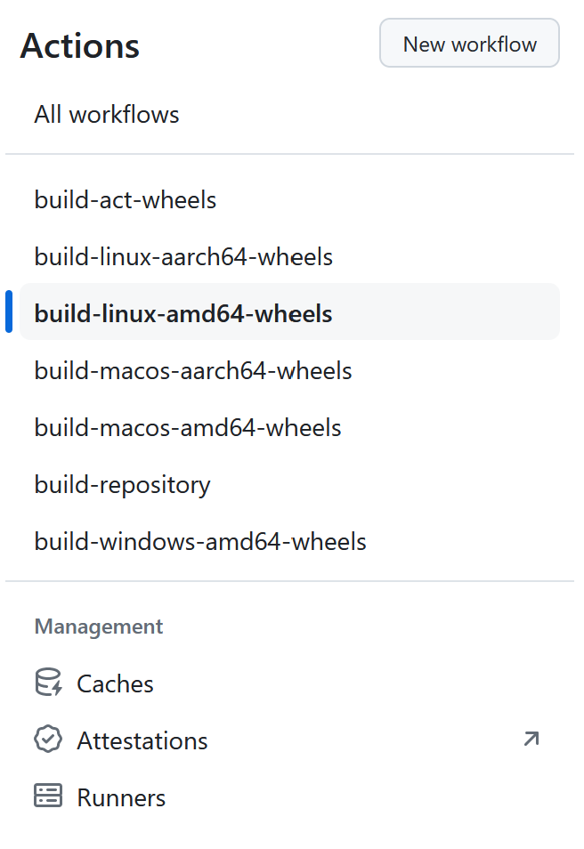
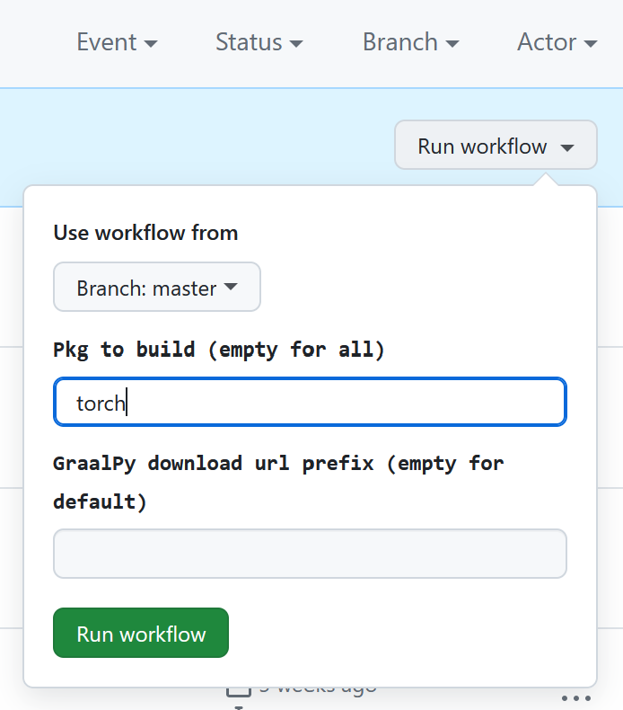

# Scripts to build wheels for GraalPy.

[GraalPy](https://github.com/oracle/graalpython) is compatible with many Python libraries, including those that extend the Python runtime with native code.
However, implemented in Java and thus binary incompatible with existing extensions, users of native Python extension libraries such as NumPy, SciPy, or PyTorch have to build their own binaries when installing these libraries if neither the project nor the GraalPy team provides prebuilt wheels.
For many libraries, this means installing additional build dependencies and sitting through long and resource-intensive compilation processes.

This project is meant to be a place for the community to collect build recipes for as many popular packages as possible that can then be built individually or in CI/CD systems like GitHub Actions.

## Quickstart

1. [Fork](../../../../fork) this repository.
2. Go to the [actions](../../../../actions) on your fork.
3. On the left, choose the Workflow for the OS you are interested in.

   

4. Click on "Run workflow".
   You can enter a package name or build all packages.
   See [the platform subfolders](../../../../blob/master/scripts/wheelbuilder/) for which packages have buildscripts.

   

## How to contribute

We collect simple build scripts per platform and package in the `linux`, `darwin`, and `win32` subdirectories.
The format is simply the package name followed by `.sh` for macOS and Linux or `.bat` for Windows.
An additional component can be added in between the name and the extension.
This file is then only run if the process environment contains a variable matching the middle component.
That can be useful to put things like package installations specific to GitHub Actions while keeping the main build script generic for other platforms.

## How to run this

Just run the `build_wheels.py` script.
It expects a URL to download the GraalPy release from.
You can set the environment variable `PACKAGES_TO_BUILD` to a comma-separated list of package build scripts you want to consider.
